## Advanced Organic Chemistry Notes# Reactions of Alkenes## Addition of Peroxyacid to Alkene* Epoxide $\rightarrow$ ether in which oxygen is incorporated into 3-member ring
  * Is a carboxylic acid with extra oxygen atom
# Substitution Reactions of Alkyl Halides## Stereochemistry Nomenclature Review* Spatial method $\rightarrow$ Right-hand rule
  * Rank groups 1-4
  * Orient right thumb from asymmetric carbon towards #4 substituent
  * If can curl fingers from #1 to #2 to #3 in order $\rightarrow$ R configuration
  * If not, S configuration
  

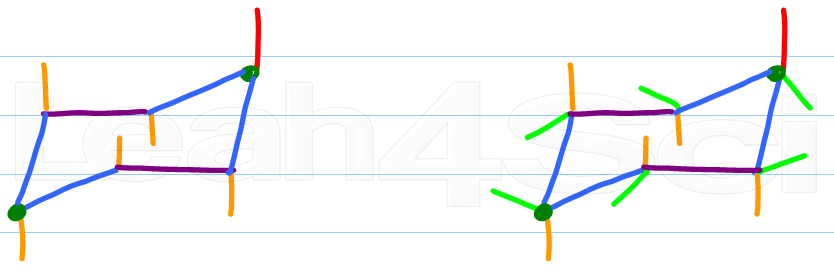

## Basics* Substitution reaction $\rightarrow$ electronegative atom/group replaced by another atom/group
* Elimination reaction $\rightarrow$ eliminate the electronegative group + an adjacent hydrogen
* Leaving group is substituted/eliminated
  

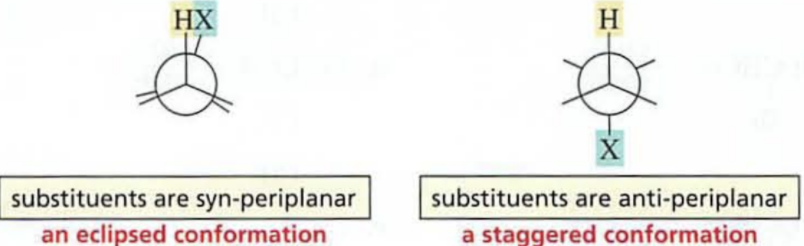

* Alkyl halide $\rightarrow$ leaving group is F–, Br–, etc
## Alkyl Halide Reactions* Halogen attached to carbon $\rightarrow$ polar bond with partial positives $\delta^+$ and $\delta^-$
* Nucleophilic $\rightarrow$ a nucleophile approaches carbon and causes break of halogen-carbon bond
* Two possible mechanisms for nucleophilic substitution
  

  

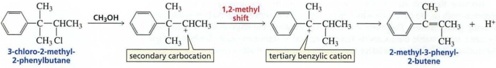

* Predominant mechanism depends on
  * Structure of halide
  * Reactivity of nucleophile
  * Concentration of nucleophile
  * Solvent of reaction
## SN2 Reaction Mechanism* Rate of nucleophilic substitution depends on concentration of reagents
  * i.e. $\mathrm{rate}\propto[r_1][r_2]$ where $[r_1],[r_2]$ are rate constants with some proportionality k
  * Thus a second-order reaction
* SN2 reaction  $\rightarrow$ substitution, nucleophilic, and bimolecular
  * Bimolecular $\rightarrow$ 2 molecules involved in transition state of rate-det-step
  * Concerted so no intermediates $\rightarrow$ nucleophile attacks carbon with leaving group, displaces
  

* Productive collision $\rightarrow$ nucleophile must hit carbon opposite to leaving group in back-side attack
* MO theory explanation $\rightarrow$ HOMO of nucleophile interacts with LUMO of C–X bond
  * When approaching front, there is a bonding and antibonding interaction, thus not favorable
  * Also not sterically favorable
  

* Rate of SN2 reaction depends on number of alkyl groups attached to carbon undergoing attack and size of them
  

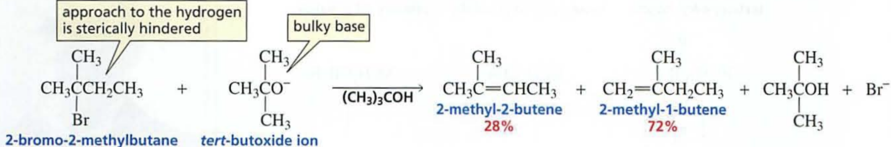

* C–H bonds can switch direction to move away from nucleophile
* Inversion is called Walden inversion
  * Thus, only one substitution product is formed when alkyl halide with halogen bonded to asymmetric center undergoing SN2 rxn
  

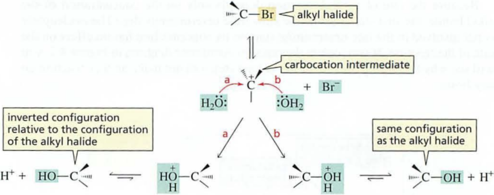

* Draw mirror image, replace halogen with nucleophile
## Factors Affecting SN2 Reactions* Leaving group in SN2 rxn $\rightarrow$ More electronegative, harder to leave so worse rxn
  * Weaker base (proton acceptor) $\rightarrow$ better leaving ability, do not share electrons well due to stability
  

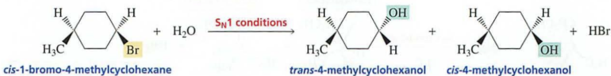

* Nucleophile in SN2 rxn
  * Nucleophilicity measure of nucleophile ability to attack electron-deficient atom, measured by rate constant k
  * Stronger bases are better nucleophiles when attacking atom is the same and when attacking atoms are similar in size
  * If attacking atoms are different in size $\rightarrow$ polarizability of atom is important
    * More polarizable $\rightarrow$ better nucleophile, overlapping of MO from farther away
  

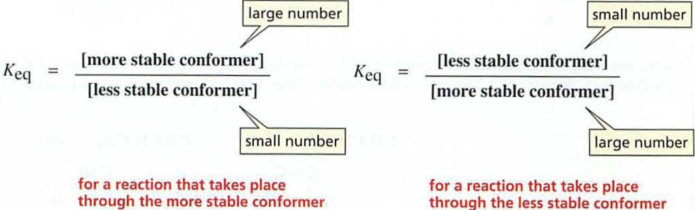

* If rxn is carried out in aprotic polar solvent (no hydrogen on O or N)
  * Relationship b/w basicity and nucleophilicity maintained $\rightarrow$ stronger bases are best nucleophiles, iodide is worst nucleophile
* Protic solvent used $\rightarrow$ inverted relationship
  * Largest atom is best nucleophile even though is weakest base, so iodide ion is best nucleophile
  

* Nucleophilicity affected by solvent $\rightarrow$ ion-dipole interactions formed
  

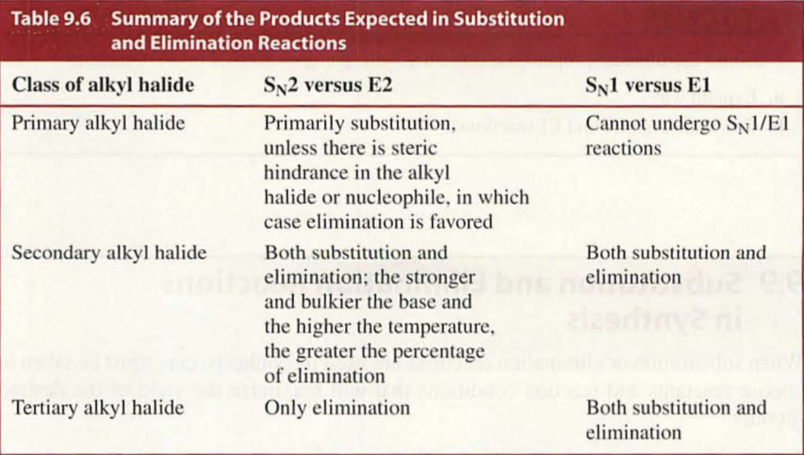

* Solvent shields nucleophile $\rightarrow$ must break reactions, so a weaker base is a better nucleophile due to less shielding
* Aprotic polar solvents $\rightarrow$ DMSO or DMF, $\delta^+$ not easily accessible $\rightarrow$ solvates cations > anions
* Steric effects $\rightarrow$ bulky nucleophile cannot approach carbon effectively, despite basicity
## Reversibility of SN2 Reactions* Can synthesize wide variety of organic compounds due to multiple nucleophiles reacting with alkyl halides
  

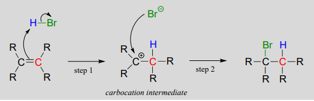

* Reaction can only be reversed if basicity of leaving group is less than that of nucleophile
  * E.g. chloride ion can’t engage in substitution for OH group in ex. 1, so it better leaving group
  * SN2 proceeds in direction that allows stronger base to displace weaker base
  * Reversible $\rightarrow$ b), irreversible $\rightarrow$ a)
  

* If difference in basicity is small $\rightarrow$ can reverse
* If concentration of C = [C] is decreased, A and B generate more product to maintain Keq
  
 

* If rxn is carried out in neutral solution $\rightarrow$ protonated product can lose proton and push rxn to products due to equilibrium disturbance
## Mechanism of SN1 Reaction  

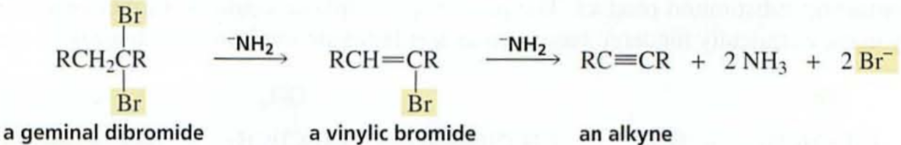

* Given above, there is no steric hindrance affecting the speed of the rxn so it is not SN2
* Changing concentration of nucleophile has no effect $\rightarrow$ $\mathrm{rate}=k[\text{alkyl halide}]$
  * Is a first-order SN1 rxn
* Unimolecular $\rightarrow$ one molecule in transition state
  

* Experimental evidence
  * Rate law shows that rxn only depends on [alkyl halide] $\rightarrow$ thus rate-determining step only involves alkyl halide
  * As methyl groups replaced by hydrogens $\rightarrow$ rxn rate decreases
    * Stability of carbocations
  

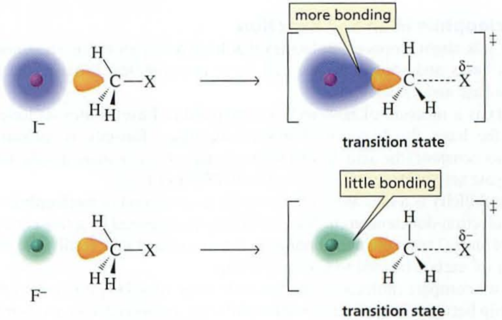

   * Substitution rxn where halogen is on asymmetric center forms 2 stereoisomers $\rightarrow$ same relative config + inverted config
  

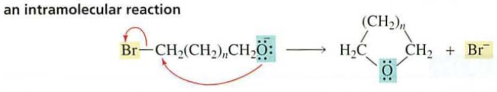

* Mechanism
  * Carbocation intermediate formed  in C–halogen bond break
     * Slow $\rightarrow$ rate-determining step
  * Protonated alcohol formed
  * pH of soln determines alcohol result in protonated or neutral form
  

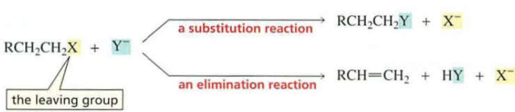

## Factors Affecting SN1 Reactions* Leaving group in SN1 rxn
  * Ease with which it disassociates from carbon and stability of carbocation formed affect rate of rxn
  * Tertiary alkyl halides more reactive as more stable $\rightarrow$ better rxn
  * Primary alkyl halides do not undergo SN1
  * Weaker base $\rightarrow$ easier to break halogen-carbon bond
    * Alkyl iodide >> alkyl fluoride
* Nucleophile role $\rightarrow$ does not participate until after rate-determining step so no effect on reactivity
  * Solvent is nucleophile in most SN1
* Carbocation rearrangements can occur
  

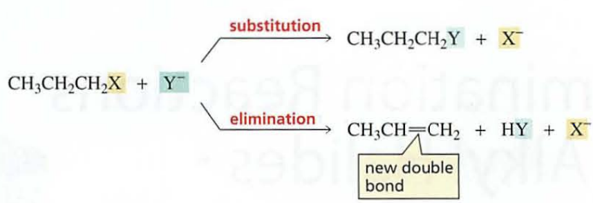

## Stereochemistry of SN2 and SN1 Reactions* SN1 rxn results in pair of enantiomer products
* Can only predict stereoisomers formed through reactant configuration and type of rxn
  * E.g. for SN2 $\rightarrow$ inverted configuration of reactant
* SN1 forms both inverted and non-inverted $\rightarrow$ either complete or partial racemization
  

  

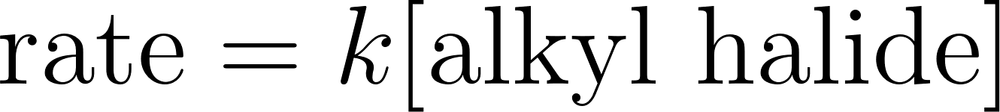

## Benzylic Halides, Allylic Halides, Vinylic Halides, Aryl Halides* Benzylic and allylic halides 
  * Readily undergo SN2 unless tertiary due to sterics
  * Also undergo SN1 well $\rightarrow$ carbocations stabilized by electron delocalization
* If resonance contributors have diff. groups bonded to sp2 carbons $\rightarrow$ two substitution products due to electron delocalization
  

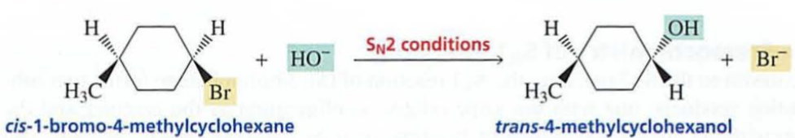

* Vinylic + aryl halides $\rightarrow$ halogen attached to aromatic ring $\rightarrow$ do not undergo SN1,2 rxns
  

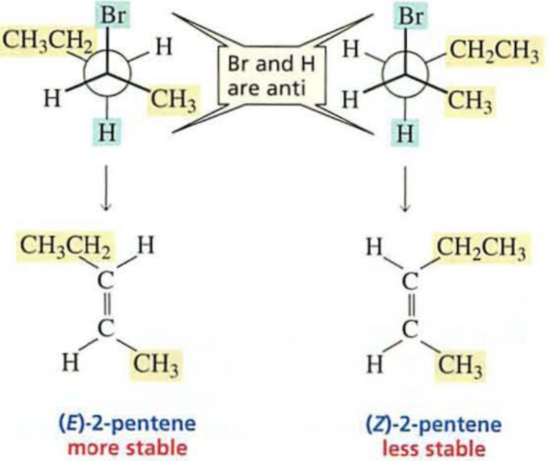

* Vinylic and aryl halides reason for non-reactive
  * Unstable due to +ve charge on sp carbon, and bonded to a stronger sp2 carbon
## Competition between SN2 and SN1 Reactions  

  

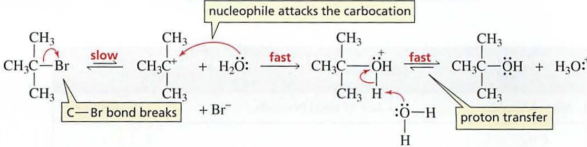

* If alkyl halide can undergo SN1 and SN2 $\rightarrow$ simultaneous rxns
  * Conditions determine predominant rxn
    * Concentration of nucleophile, reactivity of nucleophile, solvent of rxn
* Rate law for simultaneous rxn is by contribution $\rightarrow$ $\text{rate}=k_2\text{[alkyl halide]}\text{[nucleophile]}+k_1\text{[alkyl halide]}$
  * Increasing [nucleophile] increases SN2 fraction
  * Increasing rate constant k2 of SN2 = increasing reactivity of nucleophile
* High concentration of good nucleophile $\rightarrow$ favors SN2 rxn
* SN1 rxn favored by poor nucleophile
## Role of Solvent in SN2 and SN1 Reactions* Dielectric constant of solvent measures how well polar opposite charges are insulated
  * Cluster around a charge to insulate
  * Positive poles $\rightarrow$ surround –ve, etc.
* Ion interacting with polar solvent $\rightarrow$ spread to surrounding solvent molecules for stability
  * Protic solvents $\rightarrow$ H bonded to O or N $\rightarrow$ hydrogen bond donors
  * Aprotic solvents $\rightarrow$ lack this bonding
* Solvation in polar solvent allows for dissociation of C–X bond $\rightarrow$ provides energy, cannot take place in nonpolar solvent
* Solvent and rxn rates
  * Increasing polarity of solvent will decrease rate if $\geq$ 1 reactants are charged in rate-det-step
  * Will increase rate of rxn if none of reactants in rate-det-step are charged
* If charge on reactants > charge of transition states $\rightarrow$ polar solvent stabilizes reactants more
  * Bigger energy difference $\rightarrow$ more polar solvent decreases rate
* If charge on transition state > charge on reactants $\rightarrow$ polar solvent stabilizes transition state more
  * Smaller energy difference $\rightarrow$ more polar solvent increase rate
* Solvent effect on SN1 rxn rate
  * Transition state involving carbon-halogen bond has higher charge $\rightarrow$ polar solvent increases rate
* Solvent effect on SN2 rxn rate
  * Stabilizes nucleophile more than transition state because transition state distributes charge over 2 atoms $\rightarrow$ decrease rxn rate with polarity
  * Will increase rate if between alkyl halide and neutral nucleophile
* For substitution rxn $\rightarrow$ solvent effect depends on whether reactant in rate-det-step is charged
## Intermolecular vs. Intramolecular Reactions  

* Molecule with 2 functional groups $\rightarrow$ bifunctional molecule
  * 2 rxns occur if two functional groups can react $\rightarrow$ intermolecular rxn or between
  * If products subsequently react $\rightarrow$ form a polymer
  

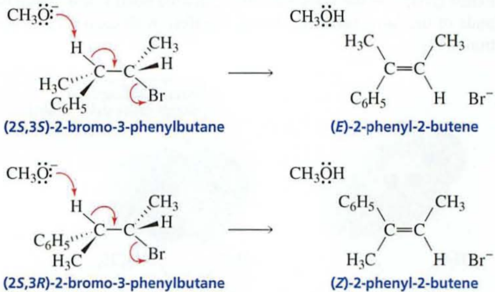

* Intramolecular rxn $\rightarrow$ occurs within the molecule
* Preference depends on concentration of molecule and size of ring formed
  * 5 or 6 membered rings favored over others
  * Low concentration favors intramolecular rxn
## Biological Methylating Reagents* Methyl iodide best possible leaving group if choosing a methyl group on a nucleophile
* Organic molecules $\rightarrow$ SAM and SAF methylating agents
  * Soluble in water
  * Transfer methyl group to a nucleophile
* Very good leaving groups
# Elimination of Alkyl Halides* Elimination rxn $\rightarrow$ atoms/groups removed from reactant to generate a product
  

## E2 Reaction* Is bimolecular elimination rxn with rate dependent on concentrations of both alkyl halide + hydroxide ion ($\mathrm{rate}=k[\text{alkyl halide}][\text{base}]$)
  

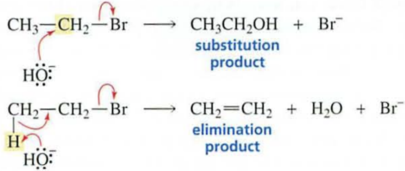

* Second order rxn $\rightarrow$ both alkyl halide + hydroxide involved in transition state
  

* Can portray the rxn as concerted single-step
* Removal of proton and halide ion $\rightarrow$ dehydrohalogenation
  

* alpha-carbon $\rightarrow$ carbon to which halogen is bonded
* $\beta$-carbon $\rightarrow$ adjacent to alpha-carbon
  * E2 initiated by deprotonating a ß-carbon $\rightarrow$ ß-elimination rxn
* In alkyl halide series $\rightarrow$ weaker bases are better leaving groups
  * RI > RBr > RCl > RF
## Regioselective E2 Rxn  

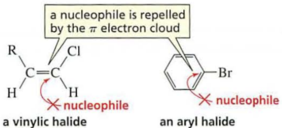

* 2-bromobutane $\rightarrow$ 2 structurally different ß-carbons from which proton can be removed
  * Therefore forms 2 elimination products
* Alkene-like transition state $\rightarrow$ the more stable alkene will predominate
* Shortcut to predicting most substituted alkene $\rightarrow$ Zaitsev’s rule
  * More substituted alkene will be formed by removing proton from beta-carbon bonded to least hydrogens, not more stable alkene necessarily
  * Does not work if alkyl halide has double bond or ring
* Exceptions to stability rule $\rightarrow$ rxn prefers less steric hindrance given a bulky base, but only if steric hindrance is large
  

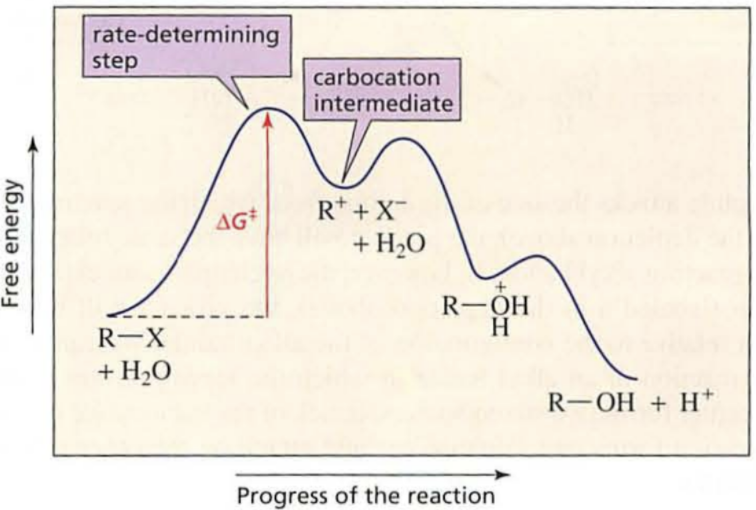

* In below case, steric hindrance not enough to overcome general stability rule
  

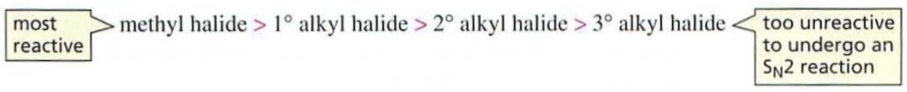

* Major product of dehydrohalogenation of alkyl fluorides is less substituted alkene
  * Strongest leaving base = poorest leaving group
  * Negative charge builds on alpha-carbon $\rightarrow$ carbanion transition state
* Carbanion stability $\rightarrow$ destabilized by electron-donating alkyl groups
* Summary $\rightarrow$ major product of E2 elimination rxn = more stable alkene except when reactants sterically hindered || poor leaving group (e.g. alkyl fluoride)
## E1 Reaction* Unimolecular elimination rxn
* First order elimination $\rightarrow$ rate of rxn depends only on concentration of alkyl halide
  * $\mathrm{rate}=k[\text{alkyl halide}]$
* Alkyl halide takes part in rate-determining strep of rxn
  * E1 rxn has $\geq 2$ steps
  * First step is rate-determining
* E1 rxn mechanism
  * Alkyl halide disassociates $\rightarrow$ forms carbocation
  * Base forms elimination product $\rightarrow$ removes the beta-carbon
  

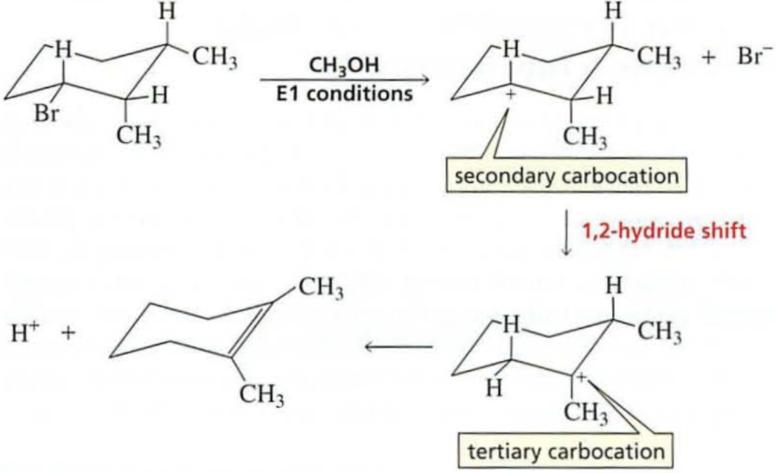

* pKa $\rightarrow$ larger means weaker acid $\implies$ higher Ka $\rightarrow$ stronger acid
  * pKa reduced by +ve carbon in 2nd step $\rightarrow$ can accept electrons left by deprotonation
  * Carbon adjacent to +vely charged carbon (beta) shares charge due to hyperconjugation
    * Drains electron density from C–H bond $\rightarrow$ weakens it
* Rxn is regioselective $\rightarrow$ more substituted alkene is the major product
  

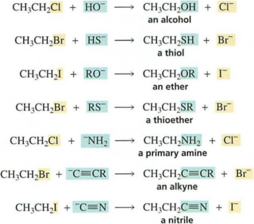

* More stable carbocation $\rightarrow$ easier to form
* Weakest bases are best leaving groups $\rightarrow$ RI > RF in reactivity
* For both E2 and E1 rxn
  * Major product is most stable alkene
  * Tertiary alkyl halides most reactive > primary alkyl halides
  

* E1 rxn forms carbocation intermediate $\rightarrow$ carbocation rearrangement can occur for more stability
* Comparison with electrophilic addition
  * Addition $\rightarrow$ need acid to react w/ nucleophilic alkene (recall)
  

* Elimination $\rightarrow$ need base to remove proton from carbocation to form alkene 
  

## E1 and E2 Competition* Primary alkyl halides undergo only E2 rxn $\rightarrow$ not E1 as primary carbocations too unstable for formation
* Secondary/tertiary undergo both E1 and E2
* Correspondence with substitution $\implies$ E1 = SN1 and E2 = SN2
  * E2 rxn favored by high concentration of strong base (nucleophile) + aprotic polar solvent
  * E1 rxn favored by weak base and protic polar solvent
## Stereoselective E1 and E2s* C-X and C-H bonds must be in same plane[a] $\rightarrow$ orbitals of each of these carbons become overlapping p orbitals in transition state
  * Optimal overlap $\implies$ parallel orbitals
  

* Can be parallel on same side of molecule (syn-periplanar) or on opposite sides (antiperiplanar)
  * Elimination from opposite/same sides of C-C bond $\rightarrow$ anti/syn elimination
  * Syn elimination much slower, anti favored in an E2 rxn
  * Syn requires an eclipsed (unstable) conformation over staggered (anti)
* Sawhorse projections[b]
  

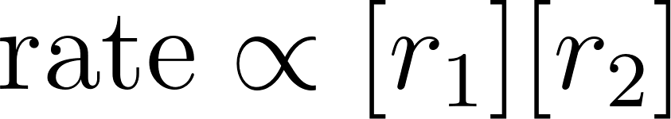

* Syn elimination $\rightarrow$ electrons of removed H move to front of C-X carbon
* Anti elimination $\rightarrow$ electrons of removed H move to back of C-X carbon
  * Best interacting orbital overlap
  * Electron rich base spared repulsion
* Thus, E2 is stereoselective in favoring E/trans over Z/cis
* If reactant has 2 hydrogens bonded to beta-carbon (from which H is removed) $\rightarrow$ E and Z products formed $\rightarrow$ 2 conformers from which eliminated groups are anti
  

* Alkene with bulkiest groups on opposite sites of == bond formed in greater yield $\rightarrow$ more stable If due to sterics
* If beta-carbon bonded to only 1 hydrogen $\rightarrow$ only on conformer from which eliminated groups are anti $\rightarrow$ 1 alkene product
  

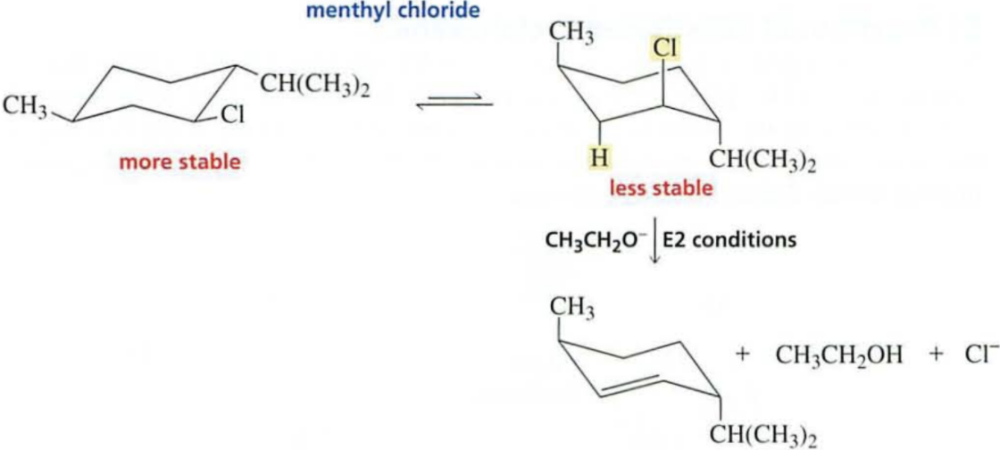

* Non-eliminated groups retain spatial positions
* E1 stereochemistry $\rightarrow$ major product will have bulkiest products on opposite sides of bonds
  * Both syn and anti elimination can occur due to carbocation being planar, electrons from departing proton can move towards +ve carbon from either side
* E and Z products formed regardless of beta-carbon having 1 or 2 hydrogens, contrast w/ E2
  

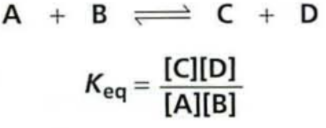

## Elimination from Substituted Cyclohexanes* Follows same stereochemical rules as elimination from open-chain compounds
  

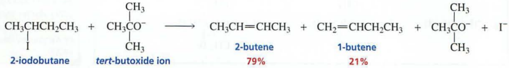

* Must have parallel groups for elimination $\rightarrow$ axial positions
   * More stable conformer of chlorocyclohexane has equatorial groups, but does not undergo E2
  

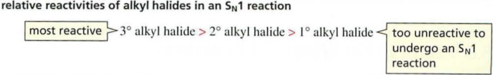

* Rate constant given by Keq $\rightarrow$ larger means faster rxn
  

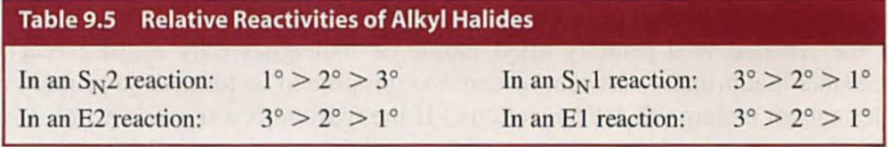

* Hydrogen eliminated may not be from beta-carbon bonded to fewest hydrogens $\rightarrow$ rule states that when there is more than one beta-carbon from which H can be removed, it is removed from C with min carbons
  * H in this case must be in axial position, and for below ex. there is only one beta-carbon with axial H
  

* Stereochemistry of E1 rxns
  * Eliminated groups do not have to be in axial positions $\rightarrow$ elimination rxn is not concerted
  * Carbocation loses proton from beta-carbon bonded to fewest hydrogens $\rightarrow$ follows Zaitsev’s rule
* Example below has carbocation shift
  

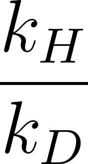

  

## Kinetic Isotope effect to Determine Mechanism* Deuterium kinetic isotope effect = $\frac{k_H}{k_D}$ where H represents a reactant with H and D represents reactant with deuterium replacing hydrogen
  * Replace a H with D and compare observed rates
  * C-D bond harder to break than C-H
* A non-unity ratio indicates that C-H or C-D bond is broken in rate-determining step $\rightarrow$ consistent with E2 mechanism
## Competition between Elimination and Substitution* Terminology $\rightarrow$ In substitution, OH– is a nucleophile but is called base in elimination
* Primary alkyl halide undergoes only SN2/E2 rxns due to unstable carbocation
  * Undergoes either if secondary or tertiary alkyl halide
* Good nucleophile encourages SN2/E2 and poor nucleophile encourages SN1/E1
* SN2/E2 Conditions $\rightarrow$ high conc. of good nucleophile/strong base
  

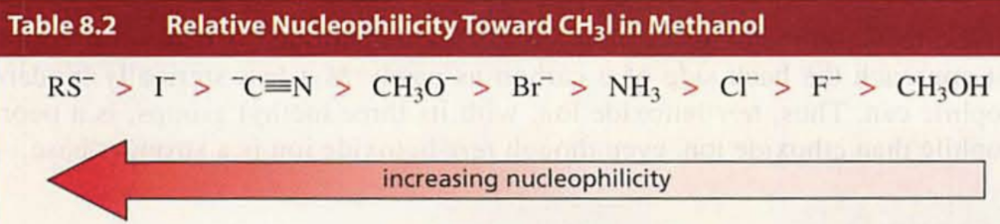

* Primary alkyl halide most reactive in SN2 due to unhindered back of alpha-carbon and least in E2
  * Substitution favored given conditions favoring SN2/E2
  

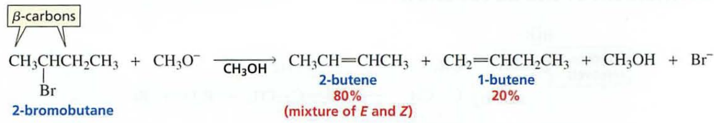

* If tertiary alkyl halide or nucleophile/base sterically hindered $\rightarrow$ elimination preferred
* Secondary alkyl halides can form both substitution and elimination products under SN2/E2
  * Stronger and bulkier base $\implies$ greater percentage of elimination product
* Higher temperatures favor elimination due to greater $\Delta S$ value for elimination rxn as it forms more product molecules > substitution
* For tertiary alkyl halides $\rightarrow$ only elimination product formed under SN2/E2 conditions
* SN1/E1 conditions $\rightarrow$ poor nucleophile/weak base
  * Alkyl halide disassociates to form carbocation, then either elimination or substitution product
  

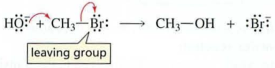

* Will give both substitution and elimination products
  * Primary alkyl halides do not undergo either rxn due to instability
  

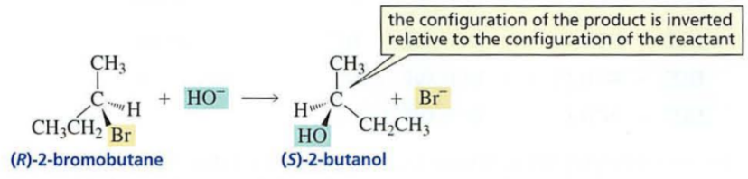

## Substitution and Elimination Reactions in Synthesis* Substitution rxns to synthesize compounds
  

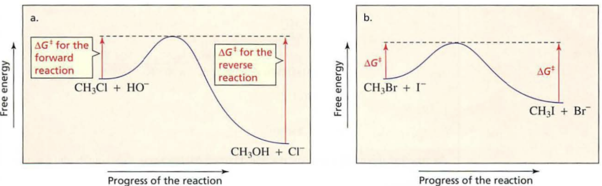

* Williamson ether synthesis $\rightarrow$ nucleophilic substitution rxn, needs a good nucleophile conc. $\rightarrow$ therefore is SN2
  * Can’t use tertiary alkyl halide as would only form elimination product (SN2/E2)
* Acetylide anion + alkyl halide synthesis for alkynes $\rightarrow$ also SN2 rxn
* Elimination rxn to synthesize compounds
  * Choose most hindered alkyl halide to maximize elimination product
## Consecutive E2 Elimination Reactions* Alkyl dihalides can undergo 2 dehydrohalogenations $\rightarrow$ 2 double bonds (diene)
* Zaitsev’s rule products stable product of first but not 2nd step due to a conjugated diene being more stable than isolated (separated by 1 single bond)
  

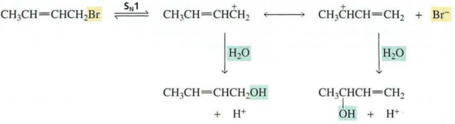

* If 2 halogens on same carbon (geminal dihalide) $\rightarrow$ alkyne is formed
* Strong base needed to perform elimination on vinylic halide
* Reacting alkene with Br2 or Cl2 forms vicinal dihalide $\rightarrow$ converts double to triple bond
  

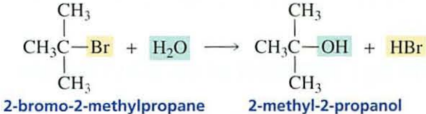

## Designing Synthesis II* Read Section 9.11.
